# ZOEL-Webshop

## Concept
Some family members are creating decorations, and they asked me if I could create a pretty simple "webshop" for them. They didn't want anything complicated, no payment possibilities, no database.

I thought it was a great opportunity to get in touch with React Native, so I said yes. I do not want to share the code. I do not know how nice it is, as I was never a front-end developer, but the real reason is that it may contain information that I would not want to share. I don't want to go through the whole project, so I will only share some screenshots of what it looked like.

I used the following video as a starting point: https://www.youtube.com/watch?v=377AQ0y6LPA

It was a great starting point, and as you can see, I hold the same structure and outlook. Maybe it looks like I did not add too many additional things; however, I had to implement many things in order to create from this fancy demo a real, working, and usable website. After I finished with the first version, which was basically the result of my practice with the help of the video, I deleted almost everything and started to build it up from scratch with my fresh knowledge.

## Screenshots

###  Home Page 
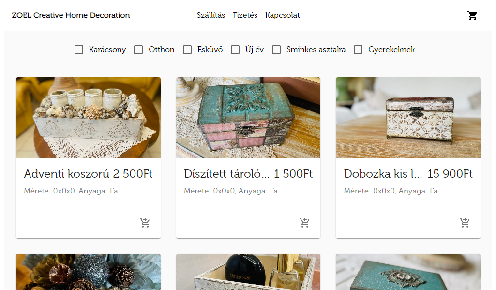
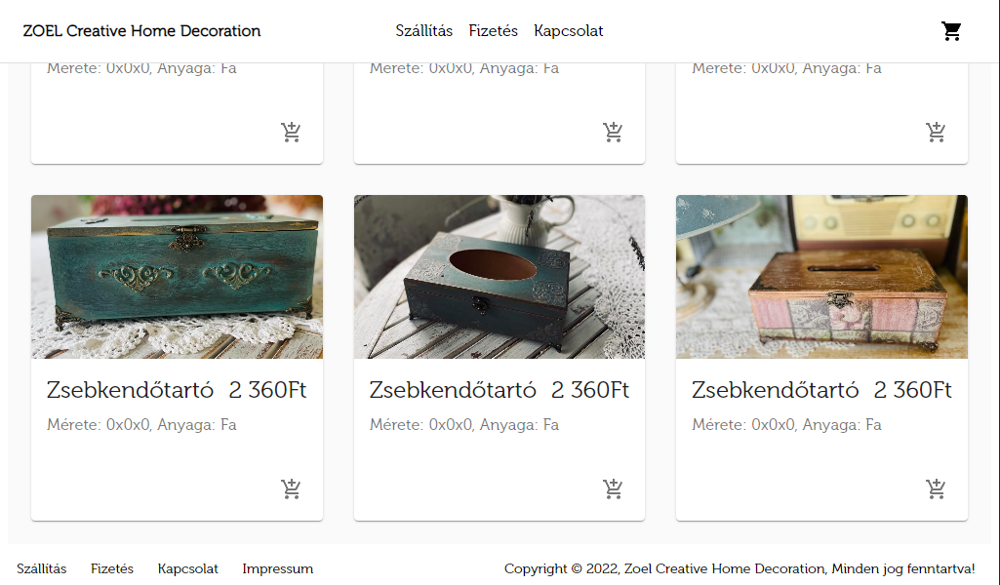

###  Shipping Page
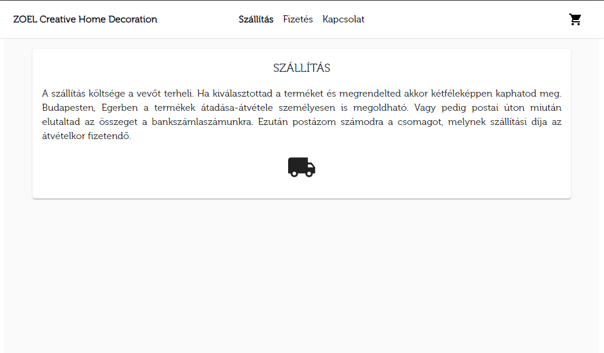

###  Payment Page
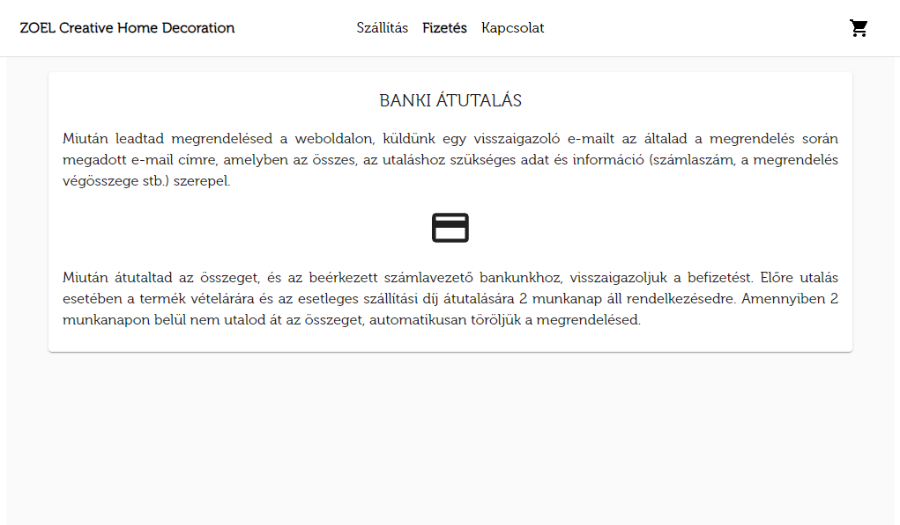

###  Contact Page
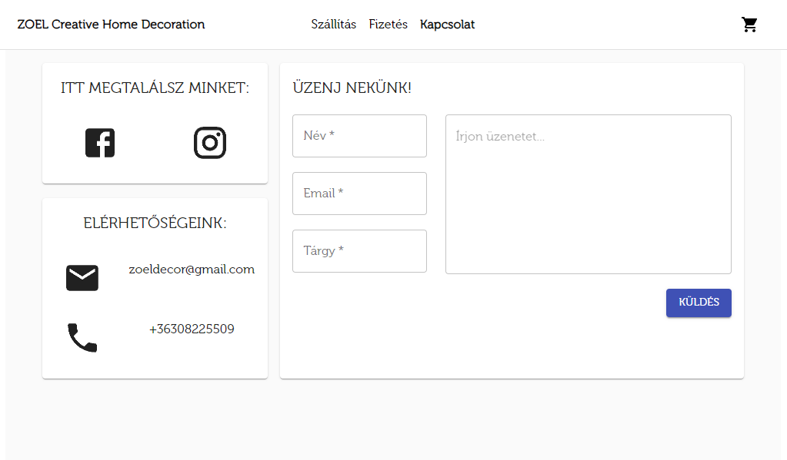

###  Slider
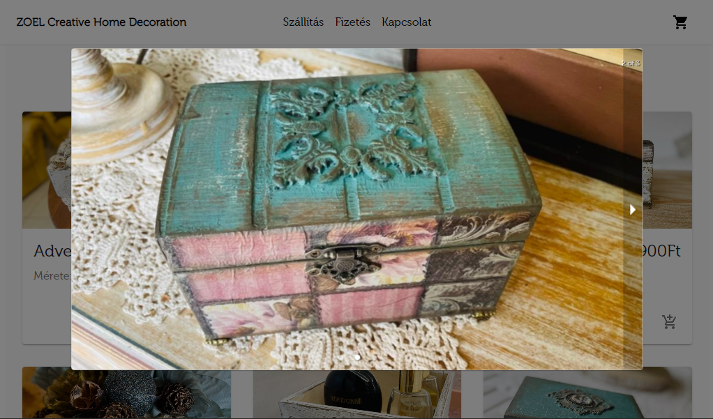

### Cart
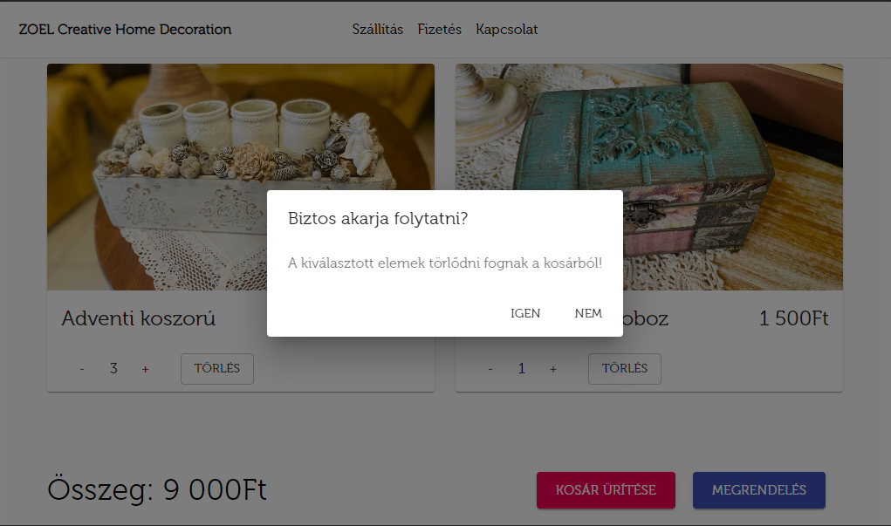

### Order address
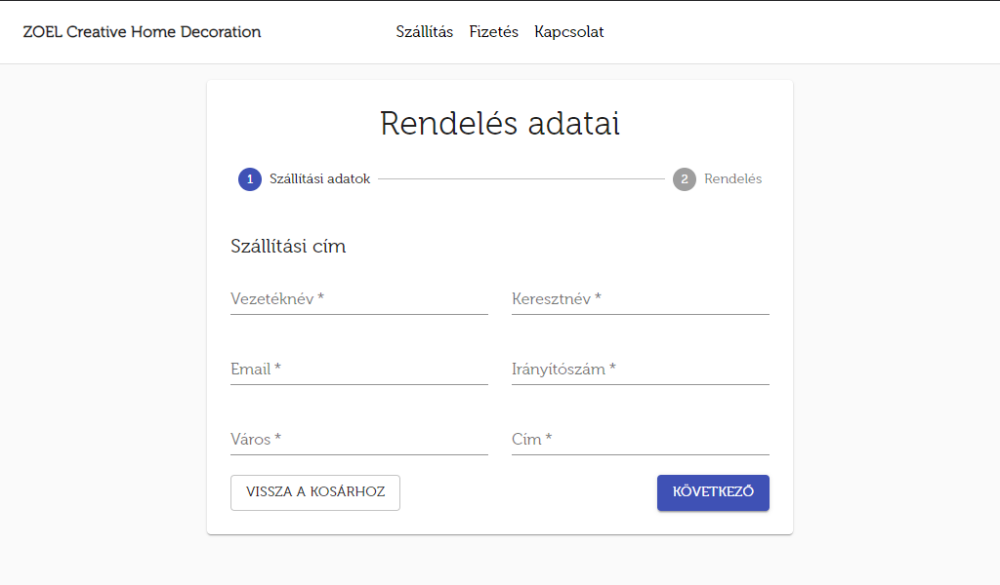

### Validation
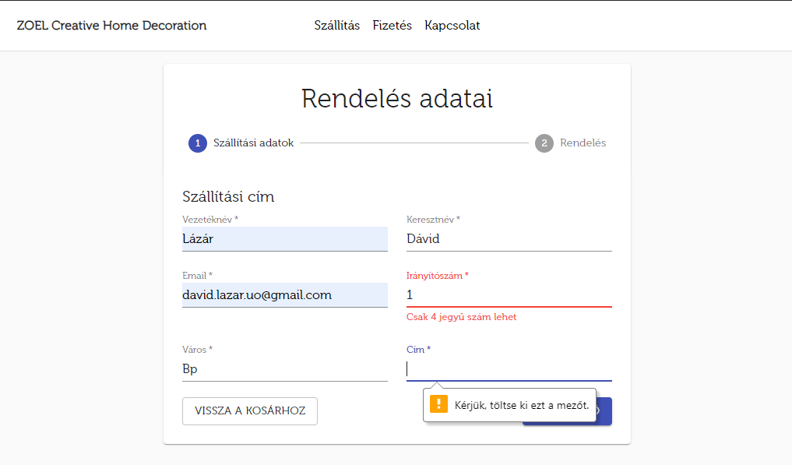

### Order summary
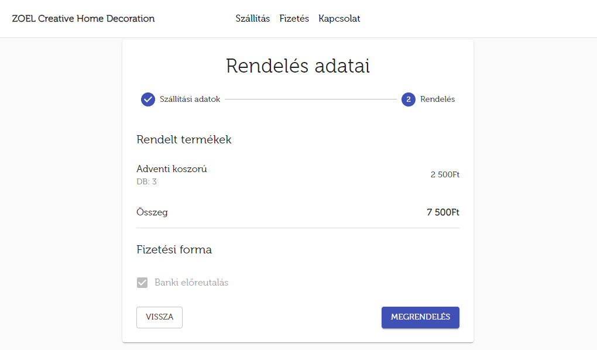

### Mobile view
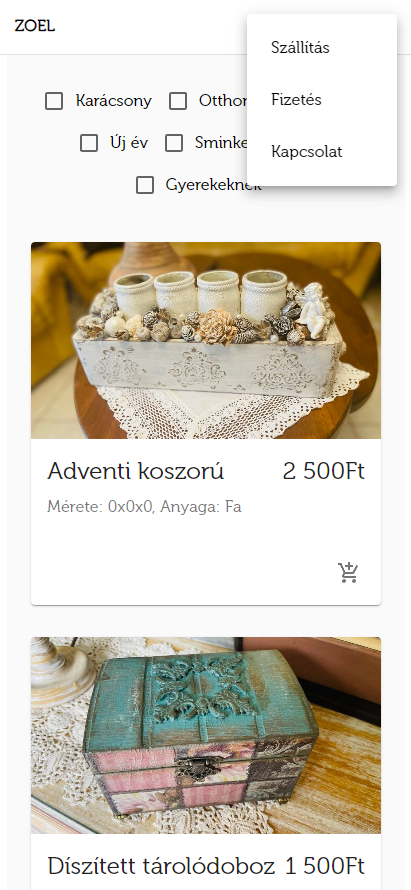

## Project technical details
* GitHub was used for version control.  
* Trello for task management  
* VSCode for development  
* Material UI framework  
* Product details are saved in JSON format.  
* Text content is stored in JSON (which can be easily extended with English).  
* Using a carousel, each product can display a variety of images.  
* Option to filter products based on their themes  
* Option to send emails with response validation and popup information (EmailJS).  
* Fully operational cart  
* A fully functional order process that will send an e-mail containing the order details to an internal address (this was a requirement)
* A fully responsive design
